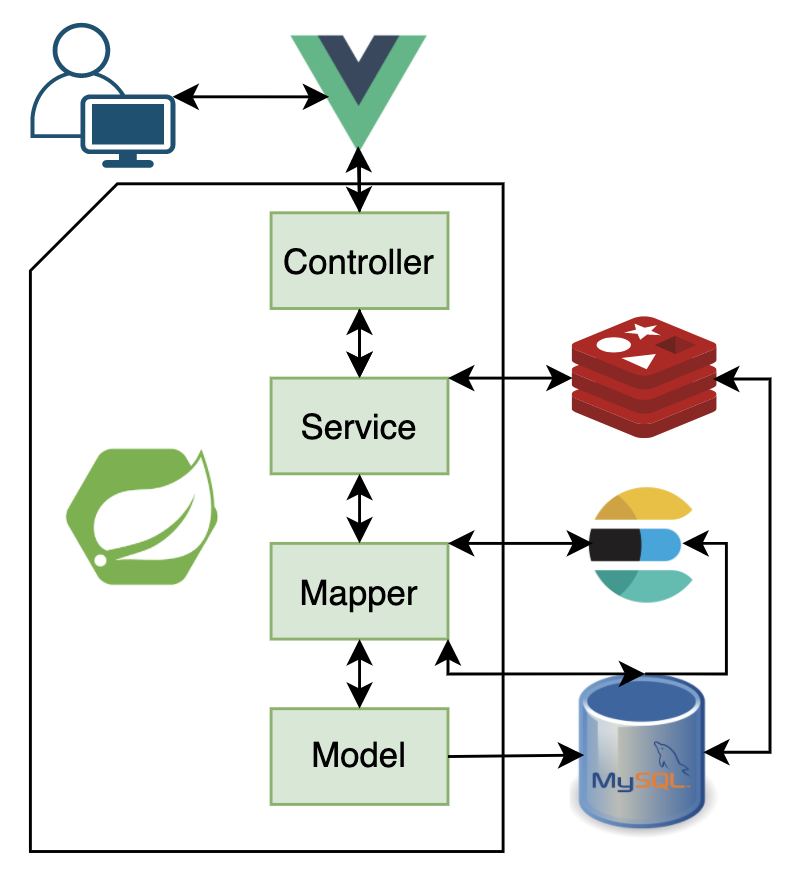

# Coconut Blog

Coconut is a blog community for users to register, login, share daily thoughts, make comments, and follow other users. 

**Technology Stack**: Spring Boot, MySQL, MyBatis, Redis, Elasticsearch, Vue.js. 

## Architecture

## Entity Relationship Diagram

## Blog Sample

